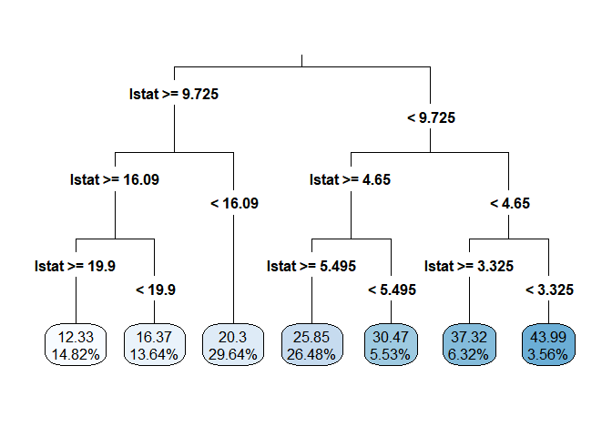
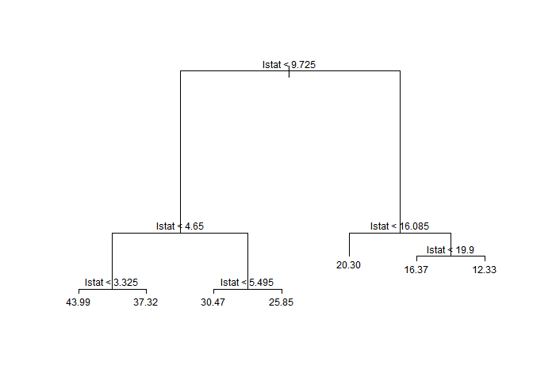
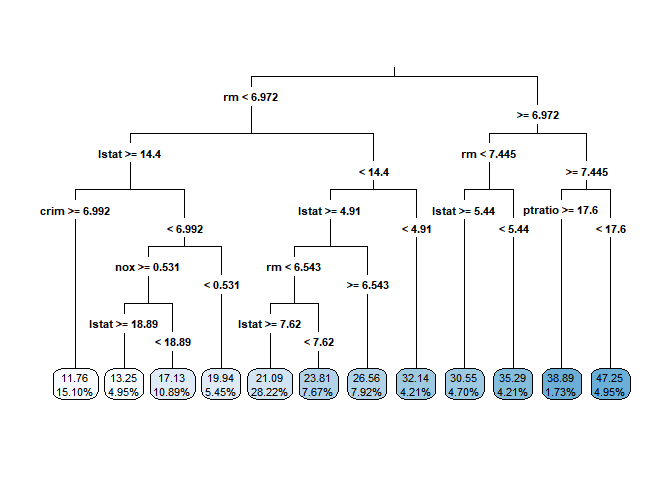
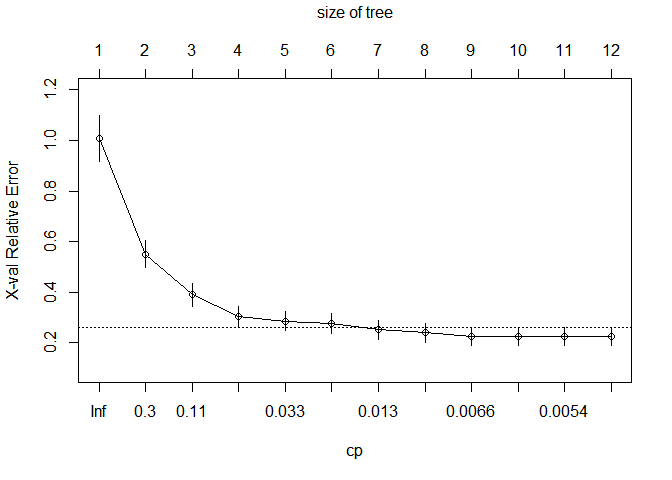
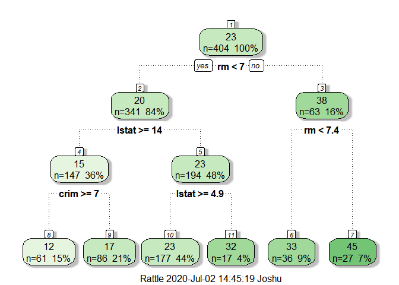
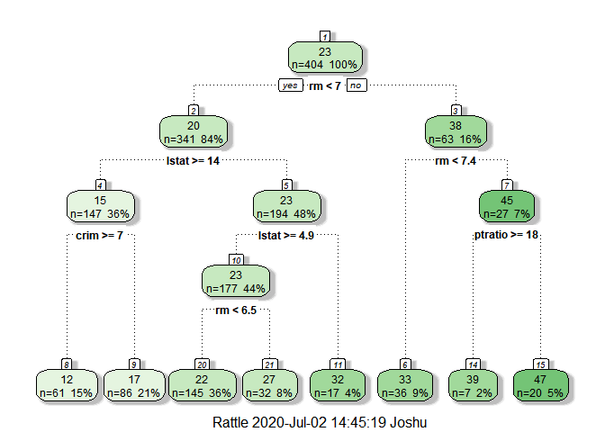
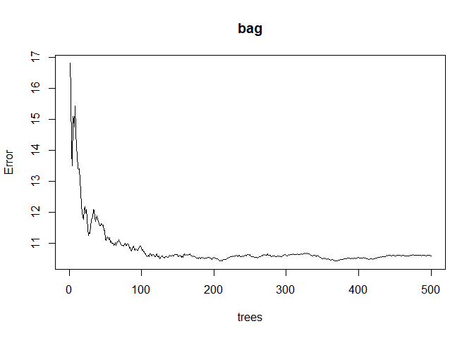

Regression Trees
================
By: Joshua Freimark
05/08/2020

  - R version 4.0.0 (2020-04-24)

  - Model a univariate and multivariate regression tree and prune the
    tree using the the Boston, MASS dataset. This script is a extention
    of the
    [CV\_LASSO1.md](https://github.com/joshuascodes/R/blob/master/CV_LASSO1.md)
    file in my R repository.

### 1\. Univariate Tree Analysis.

  - Use the CART (Classification and regression tree) estimator on the
    median home value with the right hand side variable LSTAT. Report
    results for 7 terminal nodes. Provide a graph of the median home
    value as a function of LSTAT, and a graph of your piecewise
    approximation to it.

<!-- end list -->

``` r
Final536 = read_excel("C:/Users/Joshu/OneDrive/Desktop/WSU courses/Econ536/Homework/Final/Final536.xlsx")
```

``` r
set.seed(123)
tree = rpart(medv ~ lstat, method = "anova", data = Final536)
tree
```

    ## n= 506 
    ## 
    ## node), split, n, deviance, yval
    ##       * denotes terminal node
    ## 
    ##  1) root 506 42716.3000 22.53281  
    ##    2) lstat>=9.725 294  7006.2830 17.34354  
    ##      4) lstat>=16.085 144  2699.2200 14.26181  
    ##        8) lstat>=19.9 75  1214.0820 12.32533 *
    ##        9) lstat< 19.9 69   898.1933 16.36667 *
    ##      5) lstat< 16.085 150  1626.6090 20.30200 *
    ##    3) lstat< 9.725 212 16813.8200 29.72925  
    ##      6) lstat>=4.65 162  6924.4230 26.64630  
    ##       12) lstat>=5.495 134  5379.1940 25.84701 *
    ##       13) lstat< 5.495 28  1049.9370 30.47143 *
    ##      7) lstat< 4.65 50  3360.8940 39.71800  
    ##       14) lstat>=3.325 32  2109.5620 37.31563 *
    ##       15) lstat< 3.325 18   738.3178 43.98889 *

``` r
summary(tree)
```

    ## Call:
    ## rpart(formula = medv ~ lstat, data = Final536, method = "anova")
    ##   n= 506 
    ## 
    ##           CP nsplit rel error    xerror       xstd
    ## 1 0.44236500      0 1.0000000 1.0023180 0.08309095
    ## 2 0.15283400      1 0.5576350 0.6440585 0.04943491
    ## 3 0.06275014      2 0.4048010 0.4851787 0.04132628
    ## 4 0.01374053      3 0.3420509 0.4015228 0.03864690
    ## 5 0.01200979      4 0.3283103 0.3875277 0.03847236
    ## 6 0.01159492      5 0.3163005 0.3864599 0.03892207
    ## 7 0.01000000      6 0.3047056 0.3800792 0.03795730
    ## 
    ## Variable importance
    ## lstat 
    ##   100 
    ## 
    ## Node number 1: 506 observations,    complexity param=0.442365
    ##   mean=22.53281, MSE=84.41956 
    ##   left son=2 (294 obs) right son=3 (212 obs)
    ##   Primary splits:
    ##       lstat < 9.725  to the right, improve=0.442365, (0 missing)
    ## 
    ## Node number 2: 294 observations,    complexity param=0.06275014
    ##   mean=17.34354, MSE=23.83089 
    ##   left son=4 (144 obs) right son=5 (150 obs)
    ##   Primary splits:
    ##       lstat < 16.085 to the right, improve=0.3825785, (0 missing)
    ## 
    ## Node number 3: 212 observations,    complexity param=0.152834
    ##   mean=29.72925, MSE=79.31047 
    ##   left son=6 (162 obs) right son=7 (50 obs)
    ##   Primary splits:
    ##       lstat < 4.65   to the right, improve=0.3882819, (0 missing)
    ## 
    ## Node number 4: 144 observations,    complexity param=0.01374053
    ##   mean=14.26181, MSE=18.74458 
    ##   left son=8 (75 obs) right son=9 (69 obs)
    ##   Primary splits:
    ##       lstat < 19.9   to the right, improve=0.2174498, (0 missing)
    ## 
    ## Node number 5: 150 observations
    ##   mean=20.302, MSE=10.84406 
    ## 
    ## Node number 6: 162 observations,    complexity param=0.01159492
    ##   mean=26.6463, MSE=42.74335 
    ##   left son=12 (134 obs) right son=13 (28 obs)
    ##   Primary splits:
    ##       lstat < 5.495  to the right, improve=0.07152825, (0 missing)
    ## 
    ## Node number 7: 50 observations,    complexity param=0.01200979
    ##   mean=39.718, MSE=67.21788 
    ##   left son=14 (32 obs) right son=15 (18 obs)
    ##   Primary splits:
    ##       lstat < 3.325  to the right, improve=0.1526421, (0 missing)
    ## 
    ## Node number 8: 75 observations
    ##   mean=12.32533, MSE=16.18776 
    ## 
    ## Node number 9: 69 observations
    ##   mean=16.36667, MSE=13.01729 
    ## 
    ## Node number 12: 134 observations
    ##   mean=25.84701, MSE=40.14324 
    ## 
    ## Node number 13: 28 observations
    ##   mean=30.47143, MSE=37.49776 
    ## 
    ## Node number 14: 32 observations
    ##   mean=37.31563, MSE=65.92382 
    ## 
    ## Node number 15: 18 observations
    ##   mean=43.98889, MSE=41.01765

``` r
rpart.plot(tree, type = 3, digits = 4, fallen.leaves = TRUE)
```

<!-- -->

  - The rpart function cannot plot the piecewise estimation of median
    home price as a function of lstat so I must use the tree function
    for the dendrogram and the piecewise approximation plot. They both
    yield the same results. I will also plot the tree dendrogram to
    verify the results are the same as rpart.

<!-- end list -->

``` r
treeplot = tree(medv~lstat, Final536)
plot(treeplot)
text(treeplot,cex=0.75)
```

<!-- -->

  - Graph of median home value as a function of lstat and a piecewise
    approximation to it.

<!-- end list -->

``` r
plot(Final536$lstat, Final536$medv, type="p", xlab="lstat", ylab="medv", main ="Median home value as a function of lstat")
partition.tree(treeplot, add = TRUE, cex = 1.5, col = "red", lwd = 2)
```

<!-- -->

### 2\. Multivariate Tree Analysis.

  - Partition the data into 80% training and 20% testing data. We will
    use the training data to train the model and the test data to
    validate the model. If we see little to no difference between the
    model performance on the testing and training data, then our model
    is validated.

<!-- end list -->

``` r
index.cart <- sample(nrow(Final536),nrow(Final536)*0.80)
train.cart <- Final536[index.cart,]
test.cart <- Final536[-index.cart,]
```

  - Use all the variables for multivariate tree analysis Estimate the
    tree using the training data and all of the variables. 0.005 is the
    complexity param used for the full tree (tree1). The cp parameter is
    the minimum improvement required for the tree to make another split.
    The smaller the cp parameter, will result in a lower criterion
    needed for the tree to split, which will result in deeper tree with
    more splits and nodes. This tree should have many splits.

<!-- end list -->

``` r
tree1 = rpart(medv ~., method = "anova", data = train.cart, cp = 0.005)
tree1
```

    ## n= 404 
    ## 
    ## node), split, n, deviance, yval
    ##       * denotes terminal node
    ## 
    ##  1) root 404 35543.25000 22.55074  
    ##    2) rm< 6.9715 341 13262.55000 19.68592  
    ##      4) lstat>=14.4 147  2652.25300 14.79320  
    ##        8) crim>=6.99237 61   661.64920 11.75738 *
    ##        9) crim< 6.99237 86  1029.65400 16.94651  
    ##         18) nox>=0.531 64   555.01110 15.91719  
    ##           36) lstat>=18.885 20   102.57000 13.25000 *
    ##           37) lstat< 18.885 44   245.49160 17.12955 *
    ##         19) nox< 0.531 22   209.57320 19.94091 *
    ##      5) lstat< 14.4 194  4424.84100 23.39330  
    ##       10) lstat>=4.91 177  2141.78000 22.55367  
    ##         20) rm< 6.543 145  1227.66600 21.66966  
    ##           40) lstat>=7.62 114   951.87520 21.08860 *
    ##           41) lstat< 7.62 31    95.75871 23.80645 *
    ##         21) rm>=6.543 32   287.33720 26.55938 *
    ##       11) lstat< 4.91 17   859.09880 32.13529 *
    ##    3) rm>=6.9715 63  4333.79400 38.05714  
    ##      6) rm< 7.445 36   940.35560 32.78889  
    ##       12) lstat>=5.44 19   419.92740 30.54737 *
    ##       13) lstat< 5.44 17   318.26940 35.29412 *
    ##      7) rm>=7.445 27  1062.06100 45.08148  
    ##       14) ptratio>=17.6 7   465.96860 38.88571 *
    ##       15) ptratio< 17.6 20   233.33000 47.25000 *

``` r
#summary(tree1)
```

  - This tree is overly complex and is five pages of summary output.
    This model is well overfit so let’s fix that and reduce the variance
    by pruning this tree.

<!-- end list -->

``` r
rpart.plot(tree1, type = 3, digits = 4, fallen.leaves = TRUE)
```

<!-- --> 

  - Check the model’s performance for the un-pruned tree.

<!-- end list -->

``` r
train.pred.tree1 = predict(tree1, train.cart)
test.pred.tree1 = predict(tree1, test.cart)

MPSE1 = mean((test.pred.tree1 - test.cart$medv)^2)                     #MPSE
MSE1 = mean((train.pred.tree1 - train.cart$medv)^2)                    #MSE
MAE_func = function(actual, predicted) {mean(abs(actual - predicted))} #function to calculate MAE
MAE1 = MAE_func(test.cart$medv, test.pred.tree1)

tree1_not_pruned = c("tree1", MSE1, MPSE1, MAE1)
comparison_table = c("First tree model","MSE", "MSPE", "MAE")
data.frame(cbind(comparison_table, tree1_not_pruned ))
```

    ##   comparison_table tree1_not_pruned
    ## 1 First tree model            tree1
    ## 2              MSE 12.0070524772646
    ## 3             MSPE 32.3697944795952
    ## 4              MAE 3.39047940282728

  - We can see in this plot that the relative cross validation error is
    the lowest around the 6th split (seen on the top axis). The plot
    also shows that even if we chose an exceedingly small cp value,
    there is diminishing benefit by doing so measured by the relative
    cross validation error. It is best to try to find a cp parameter
    that lowers the relative cross validation error with the least
    complex tree structure. From the summary output above we can find
    the cp value that is associated with 6th nsplit which is
    0.017634191.

<!-- end list -->

``` r
plotcp(tree1)
```

<!-- -->

### 3\. Prune the tree by altering the complexity parameter

  - We will use 0.017634191 for the cp value associated with the 6th
    nsplit this time.

<!-- end list -->

``` r
tree2_prune = prune(tree1, cp = 0.017634191)
fancyRpartPlot(tree2_prune)
```

<!-- -->

  - Check the model performance. We can see the pruned tree performed
    worse than the first tree that was estimated that was not pruned. We
    measure the performance by the mean squared error (MSE), mean square
    prediction error (MSPE), and mean absolute error (MAE).

<!-- end list -->

``` r
train.pred.tree2 = predict(tree2_prune, train.cart)
test.pred.tree2 = predict(tree2_prune, test.cart)
MPSE2 = mean((test.pred.tree2 - test.cart$medv)^2)                     #MPSE
MSE2 = mean((train.pred.tree2 - train.cart$medv)^2)                    #MSE
MAE_func = function(actual, predicted) {mean(abs(actual - predicted))} #function to calculate MAE
MAE2 = MAE_func(test.cart$medv, test.pred.tree2)

tree2.pruned = c("tree2_prune", MSE2, MPSE2, MAE2)
comparison_table = c("pruned regression tree","MSE", "MSPE", "MAE")
data.frame(cbind(comparison_table, tree2.pruned, tree1_not_pruned))
```

    ##         comparison_table     tree2.pruned tree1_not_pruned
    ## 1 pruned regression tree      tree2_prune            tree1
    ## 2                    MSE 16.5707880362285 12.0070524772646
    ## 3                   MSPE 33.6098717608695 32.3697944795952
    ## 4                    MAE 3.65930317001908 3.39047940282728

  - Lets try to the cp parameter of 0.0132644 at nsplit 7.

<!-- end list -->

``` r
tree3_prune = prune(tree1, cp = 0.0132644) #from printcp(tree1): cp=0.0132644, nsplit=7 
```

  - Check if our model using cp=0.0132644 improved from the previous
    model that used cp=0.017634191

<!-- end list -->

``` r
train.pred.tree3 = predict(tree3_prune, train.cart)
test.pred.tree3 = predict(tree3_prune, test.cart)
MPSE3 = mean((test.pred.tree3 - test.cart$medv)^2)          #MPSE
MSE3 = mean((train.pred.tree3 - train.cart$medv)^2)    #MSE
MAE_func = function(actual, predicted) {mean(abs(actual - predicted))} # function to calculate MAE
MAE3 = MAE_func(test.cart$medv, test.pred.tree3)

tree3.pruned = c("tree3_prune", MSE3, MPSE3, MAE3)
comparison_table = c("pruned regression tree","MSE", "MSPE", "MAE")
data.frame(cbind(comparison_table, tree3.pruned, tree2.pruned))
```

    ##         comparison_table     tree3.pruned     tree2.pruned
    ## 1 pruned regression tree      tree3_prune      tree2_prune
    ## 2                    MSE 15.0193611977737 16.5707880362285
    ## 3                   MSPE 32.6517142565787 33.6098717608695
    ## 4                    MAE 3.52821523053295 3.65930317001908

  - Lastly, we will try cp=0.0077842 at nsplit 8

<!-- end list -->

``` r
tree4_prune = prune(tree1, cp = 0.0077842) #from printcp(tree1): 0.0077842      8 
fancyRpartPlot(tree4_prune)
```

<!-- -->

### 4\. Compare all of the models.

``` r
train.pred.tree4 = predict(tree4_prune, train.cart)
test.pred.tree4 = predict(tree4_prune, test.cart)
MPSE4 = mean((test.pred.tree4 - test.cart$medv)^2)          #MPSE
MSE4 = mean((train.pred.tree4 - train.cart$medv)^2)    #MSE
MAE_func = function(actual, predicted) {mean(abs(actual - predicted))} # function to calculate MAE
MAE4 = MAE_func(test.cart$medv, test.pred.tree4)

tree4.pruned = c("tree4_prune", MSE4, MPSE4, MAE4)
comparison_table = c("pruned regression tree","MSE", "MSPE", "MAE")
data.frame(cbind(comparison_table, tree4.pruned, tree3.pruned, tree2.pruned, tree1_not_pruned))
```

    ##         comparison_table     tree4.pruned     tree3.pruned     tree2.pruned
    ## 1 pruned regression tree      tree4_prune      tree3_prune      tree2_prune
    ## 2                    MSE 14.1214350361099 15.0193611977737 16.5707880362285
    ## 3                   MSPE  32.770652064212 32.6517142565787 33.6098717608695
    ## 4                    MAE 3.54947521600862 3.52821523053295 3.65930317001908
    ##   tree1_not_pruned
    ## 1            tree1
    ## 2 12.0070524772646
    ## 3 32.3697944795952
    ## 4 3.39047940282728

  - We can see that altering the complexity parameter did not improve
    the model performance compared to the first tree we estimated. Among
    the pruned trees, the 4th has the lowest MSE, MSPE, and MAE and it
    is a bit simpler in terms of less splits and leave nodes then the
    un-pruned tree.

<!-- end list -->

  - We will use bagging to reduce the variance of a model with a
    combination of aggregation and bootstrapping (which is bagging).
    Bagging is a model averaging approach based off many new trees.

<!-- end list -->

``` r
formu <- as.formula("medv ~ .")
bag = randomForest(formu, data=train.cart, mtry=16, importance =TRUE)
bag
```

    ## 
    ## Call:
    ##  randomForest(formula = formu, data = train.cart, mtry = 16, importance = TRUE) 
    ##                Type of random forest: regression
    ##                      Number of trees: 500
    ## No. of variables tried at each split: 16
    ## 
    ##           Mean of squared residuals: 10.57984
    ##                     % Var explained: 87.97

``` r
plot(bag)
```

<!-- -->

  - We do not achieve very much benefit by growing more than 100 trees.
    Let’s just grow 150 to be safe.

<!-- end list -->

``` r
bag2 = randomForest(formu, data=train.cart, mtry=16, importance =TRUE, ntree = 150)
bag2
```

    ## 
    ## Call:
    ##  randomForest(formula = formu, data = train.cart, mtry = 16, importance = TRUE,      ntree = 150) 
    ##                Type of random forest: regression
    ##                      Number of trees: 150
    ## No. of variables tried at each split: 16
    ## 
    ##           Mean of squared residuals: 10.44176
    ##                     % Var explained: 88.13

     

  - We used pruning and bagging to reduce the variance. Bagging is a
    good technique because it retains a low bias while also reducing
    variance. Pruning reduces the model from overfitting the data and
    overall, we can see that our model explained 88% of the variation
    post-bagging. The MSE is 10.44 which is lower than the MSE of any of
    the previous trees. Overall, my pruning method was not the most
    efficient. Cross validation is one option that could be used for
    pruning. This method would choose cross-validated error that is the
    minimum, like my procedure above, but using cross-validation
    automates the process and reduced the human error. This would help
    to reduce the variance further. Our tree does contain some bias due
    to the large depth of the tree. Trees are sensitive to splits and
    the decision to split can have large impacts on the model results.

*Packages used*

``` r
library(readxl)
library(pastecs)
library(magrittr)
library(gridExtra)
library(ggplot2)
library(rpart)
library(rpart.plot)
library(dplyr)
library(DT)
library(MASS)
library(leaps)
library(glmnet)
library(PerformanceAnalytics)
library(corrr)
library(tidyr)
library(readxl)
library(rpart)
library(rpart.plot)
library(caret)
library(tidyverse)
library(rpart)                     
library(rattle)                 
library(rpart.plot)     
library(RColorBrewer)           
library(party)                  
library(partykit)           
library(caret)  
library(olsrr)
library(FactoMineR)
library(factoextra)
library(vip)       
library(pdp)        
library(ipred)
library(tree)
library(randomForest)
```
