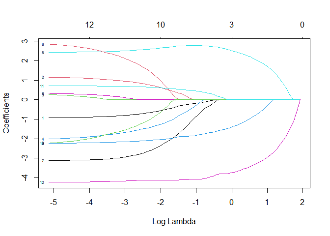
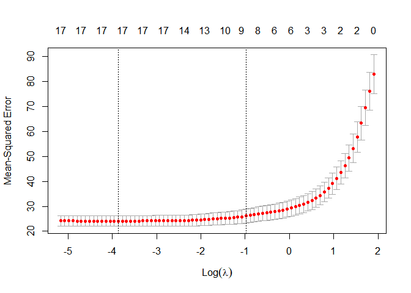
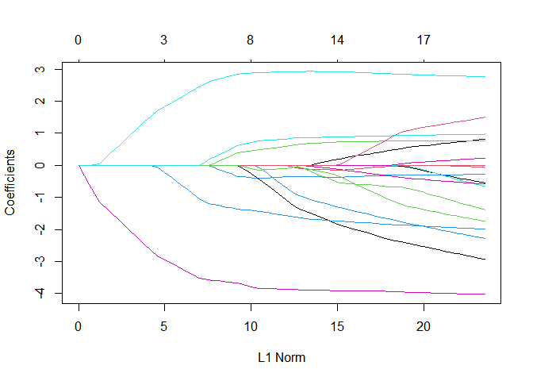

Cross Validation & LASSO
================
Joshua Freimark 
05/08/2020

  - R version 4.0.0 (2020-04-24)

  - This analysis uses the Boston, MASS housing data to implement cross
    validation and least absolute shrinkage and selection operator
    (LASSO).

  - The data is collected by the U.S Census Service concerning housing
    in the area of Boston Mass. It is reported in Harrison, D. and
    Rubinfeld, D.L. \`Hedonic prices and the demand for clean air’, J.
    Environ. Economics & Management, vol.5, 81-102, 1978. The data is
    also available at
    [lib.stat](http://lib.stat.cmu.edu/datasets/boston_corrected.txt)

  - The R package version’s used for this analysis are located at the
    bottom of this file.

Load the necessary packages.

``` r
library(readxl)
library(pastecs)
library(magrittr)
library(gridExtra)
library(ggplot2)
library(dplyr)
library(DT)
library(MASS)
library(leaps)
library(glmnet)
library(PerformanceAnalytics)
library(corrr)
library(tidyr)
```

Import the data

``` r
Final536 = read_excel("C:/Users/Joshu/OneDrive/Desktop/WSU courses/Econ536/Homework/Final/Final536.xlsx")
options(scipen=999) #To turn off scientific notation
```

  - Report descriptive statistics for the variables in the data set

<!-- end list -->

``` r
stat.desc(Final536[1:13], desc = TRUE, basic = TRUE, norm = FALSE) %>% round(2)
```

    ##                    idn     town      tract       lon      lat     medv    crim
    ## nbr.val         506.00   506.00     506.00    506.00   506.00   506.00  506.00
    ## nbr.null          0.00     1.00       0.00      0.00     0.00     0.00    0.00
    ## nbr.na            0.00     0.00       0.00      0.00     0.00     0.00    0.00
    ## min               1.00     0.00       1.00    -71.29    42.03     5.00    0.01
    ## max             506.00    91.00    5082.00    -70.81    42.38    50.00   88.98
    ## range           505.00    91.00    5081.00      0.48     0.35    45.00   88.97
    ## sum          128271.00 24051.00 1366380.00 -35954.53 21361.52 11401.60 1828.44
    ## median          253.50    42.00    3393.50    -71.05    42.22    21.20    0.26
    ## mean            253.50    47.53    2700.36    -71.06    42.22    22.53    3.61
    ## SE.mean           6.50     1.23      61.35      0.00     0.00     0.41    0.38
    ## CI.mean.0.95     12.77     2.41     120.53      0.01     0.01     0.80    0.75
    ## var           21378.50   760.18 1904501.65      0.01     0.00    84.59   73.99
    ## std.dev         146.21    27.57    1380.04      0.08     0.06     9.20    8.60
    ## coef.var          0.58     0.58       0.51      0.00     0.00     0.41    2.38
    ##                   zn   indus   chas    nox      rm      age
    ## nbr.val       506.00  506.00 506.00 506.00  506.00   506.00
    ## nbr.null      372.00    0.00 471.00   0.00    0.00     0.00
    ## nbr.na          0.00    0.00   0.00   0.00    0.00     0.00
    ## min             0.00    0.46   0.00   0.38    3.56     2.90
    ## max           100.00   27.74   1.00   0.87    8.78   100.00
    ## range         100.00   27.28   1.00   0.49    5.22    97.10
    ## sum          5750.00 5635.21  35.00 280.68 3180.02 34698.90
    ## median          0.00    9.69   0.00   0.54    6.21    77.50
    ## mean           11.36   11.14   0.07   0.55    6.28    68.57
    ## SE.mean         1.04    0.30   0.01   0.01    0.03     1.25
    ## CI.mean.0.95    2.04    0.60   0.02   0.01    0.06     2.46
    ## var           543.94   47.06   0.06   0.01    0.49   792.36
    ## std.dev        23.32    6.86   0.25   0.12    0.70    28.15
    ## coef.var        2.05    0.62   3.67   0.21    0.11     0.41

``` r
stat.desc(Final536[14:19], desc = TRUE, basic = TRUE, norm = FALSE) %>% round(2)
```

    ##                  dis     rad       tax ptratio     black   lstat
    ## nbr.val       506.00  506.00    506.00  506.00    506.00  506.00
    ## nbr.null        0.00    0.00      0.00    0.00      0.00    0.00
    ## nbr.na          0.00    0.00      0.00    0.00      0.00    0.00
    ## min             1.13    1.00    187.00   12.60      0.32    1.73
    ## max            12.13   24.00    711.00   22.00    396.90   37.97
    ## range          11.00   23.00    524.00    9.40    396.58   36.24
    ## sum          1920.29 4832.00 206568.00 9338.50 180477.06 6402.45
    ## median          3.21    5.00    330.00   19.05    391.44   11.36
    ## mean            3.80    9.55    408.24   18.46    356.67   12.65
    ## SE.mean         0.09    0.39      7.49    0.10      4.06    0.32
    ## CI.mean.0.95    0.18    0.76     14.72    0.19      7.97    0.62
    ## var             4.43   75.82  28404.76    4.69   8334.75   50.99
    ## std.dev         2.11    8.71    168.54    2.16     91.29    7.14
    ## coef.var        0.55    0.91      0.41    0.12      0.26    0.56

### *Descriptive statistics definitions*

  - Number of values (nbr.val)

  - Number of null values (nbr.null)

  - Number of missing values (nbr.na)

  - Minimal value (min)

  - Maximal value (max)

  - The range (range, that is, max-min)

  - Sum of all non-missing values (sum)

  - Median (median)

  - Mean (mean)

  - The standard error on the mean (SE.mean)

  - The confidence interval of the mean (CI.mean) at the p level

  - Variance (var)

  - Standard deviation (std.dev)

  - The variation coefficient (coef.var) defined as the standard
    deviation divided by the mean

  - Use the LASSO estimator to select the right hand side variables from
    crim, zn, indus, nox, rm, age, dis, rad, tax, ptratio, black, lstat.

Subset the data

``` r
df = subset(Final536, select=c(medv, crim, zn, indus, nox, rm, age, dis, rad, tax, ptratio,
                               black, lstat))
attach(df)
```

  - Split the data into 80% training data and 20% testing data and
    standardize the variables. The function ‘model.matrix()’
    automatically transforms qualitative variables into dummy variables
    b/c glmnet() can only take numerical, quantitative inputs.

<!-- end list -->

``` r
set.seed(123)
x = model.matrix(medv~., df)[,-1]                # drop medv from the first column
y = as.matrix(medv, df) 


index = sample(nrow(df),nrow(df)*0.80)           #Split
df.X.std = scale(dplyr::select(df, -medv))       #Standardize

X.train= as.matrix(df.X.std)[index,]
X.test=  as.matrix(df.X.std)[-index,]

Y.train= df[index, "medv"]
Y.test<- df[-index, "medv"]


Y.train = as.matrix(Y.train)
Y.test = as.matrix(Y.test)
```

Now fit the LASSO model to the training data. We can see by the plot
that the value of lambda will have a large impact on the coefficients
included in the model.

``` r
lasso1= glmnet(x=X.train, y=Y.train, family = "gaussian", alpha = 1)
plot(lasso1, xvar = "lambda", label=TRUE)
```

<!-- -->

  - Make predictions based on the testing data. The tuning
    parameter-lambda (0 \(\le \lambda \le\) 1) is represented by `s` in
    the coef() function and ‘lambda’ in the glmnet function. We choose
    0.2 to start although there are more efficient ways to choose
    lambda. A large lambda will penalize the coefficients towards 0 more
    than a low value for lambda.

<!-- end list -->

``` r
lasso_predict_train = predict(lasso1, s = 0.2, newx = X.test) 
mean((lasso_predict_train - Y.test)^2)                             # MSE for the testing data 
```

    ## [1] 24.13235

Model Validation. Estimate the model on the testing data.

``` r
lasso_test = glmnet(X.test, Y.test, alpha = 1, lambda = 0.2)      # LASSO on test dataset
lasso_test_coef = predict(lasso_test, type = "coefficients", s = 0.2) 
lasso_test_coef
```

    ## 13 x 1 sparse Matrix of class "dgCMatrix"
    ##                      1
    ## (Intercept) 22.6939174
    ## crim        -0.7705882
    ## zn           0.3091885
    ## indus       -0.2943105
    ## nox         -1.0101699
    ## rm           4.1308639
    ## age         -0.7478328
    ## dis         -1.6802472
    ## rad          .        
    ## tax         -0.2566519
    ## ptratio     -1.3430744
    ## black        1.0521297
    ## lstat       -1.8705501

*LASSO results are summarized at the bottom of this page in the
‘comparison table’*

``` r
lasso_predict_train = predict(lasso1, newx = X.train, s=0.2)           #Train Prediction
lasso_predict_test= predict(lasso1, newx = X.test, s=0.2)              #Test Prediction

lasso_lambda_2_mse = mean((Y.train-lasso_predict_train)^2)              #Mean squared error
lasso_lambda_2_mpse = mean((Y.test-lasso_predict_test)^2)              #Mean squared prediction error

sst = sum((Y.train - mean(Y.train))^2)
sse_lambda_2 = sum((Y.train-lasso_predict_train)^2)                    #Sum squared error

rsq_lambda_2 = 1 - sse_lambda_2 / sst                                  #R_squared
adj_rsq_lambda_2 = 1 - (dim(X.train)[1]-1)*(1-rsq_lambda_2)/(dim(X.train)[1]-10-1)

summary_stats = c("Lambda 2 model", lasso_lambda_2_mse, rsq_lambda_2, adj_rsq_lambda_2,
  lasso_lambda_2_mpse)
comparison_table = c("model type", "MSE", "R-Squared", "Adj R-Squared", "Test MSPE")
data.frame(cbind(comparison_table, summary_stats))
```

    ##   comparison_table     summary_stats
    ## 1       model type    Lambda 2 model
    ## 2              MSE  23.9683318186908
    ## 3        R-Squared 0.716103881420194
    ## 4    Adj R-Squared 0.708880061609003
    ## 5        Test MSPE  24.1323532794479

 

*Reporting only the right hand side independent variables selected by
LASSO.*

``` r
lasso_test_coef[lasso_test_coef != 0]
```

    ##  [1] 22.6939174 -0.7705882  0.3091885 -0.2943105 -1.0101699  4.1308639
    ##  [7] -0.7478328 -1.6802472 -0.2566519 -1.3430744  1.0521297 -1.8705501

### Post LASSO

  - All the variables except for indus are statistically significant at
    the 0.01 level or better. The coefficient standard errors measure
    the amount that the coefficient estimates vary from the true value
    of medv. The standard errors for each of the coefficients are small
    and below 1.0 for most of the coefficients. The only standard errors
    that are not below 1.0 are nox (3.58) and the intercept (4.93). The
    \(R^{2}\) is 0.7224 which means that 72% of the variation in medv is
    explained by the model. The residuals show a symmetrical
    distribution around 0 which we can see by the 25th percentile value
    that is -2.88 and 75th percentile that is 1.765. The t-values are
    large relative to the standard errors in the summary output which
    indicates there is a likely probability that we can reject the null
    hypothesis. The residual standard error is the average amount that
    medv will deviate from the predicted regression and in this model
    the RSE is 4.89 which means that our model should make accurate
    in-sample predictions.

<!-- end list -->

``` r
options(scipen = 5)                        #Turn on scientific notation
mod2 = lm(medv~ crim + zn + indus + nox + rm + dis + ptratio + black + lstat, data = df)
sum.mod2 = summary(mod2)
sum.mod2
```

    ## 
    ## Call:
    ## lm(formula = medv ~ crim + zn + indus + nox + rm + dis + ptratio + 
    ##     black + lstat, data = df)
    ## 
    ## Residuals:
    ##      Min       1Q   Median       3Q      Max 
    ## -13.2480  -2.8822  -0.7191   1.7654  27.5438 
    ## 
    ## Coefficients:
    ##               Estimate Std. Error t value Pr(>|t|)    
    ## (Intercept)  29.395453   4.936677   5.955 4.94e-09 ***
    ## crim         -0.066077   0.030703  -2.152  0.03187 *  
    ## zn            0.041289   0.013579   3.041  0.00249 ** 
    ## indus        -0.034267   0.056452  -0.607  0.54413    
    ## nox         -14.314054   3.582034  -3.996 7.42e-05 ***
    ## rm            4.187130   0.415047  10.088  < 2e-16 ***
    ## dis          -1.492621   0.196430  -7.599 1.50e-13 ***
    ## ptratio      -0.857282   0.122124  -7.020 7.35e-12 ***
    ## black         0.008674   0.002722   3.186  0.00153 ** 
    ## lstat        -0.529030   0.049073 -10.780  < 2e-16 ***
    ## ---
    ## Signif. codes:  0 '***' 0.001 '**' 0.01 '*' 0.05 '.' 0.1 ' ' 1
    ## 
    ## Residual standard error: 4.89 on 496 degrees of freedom
    ## Multiple R-squared:  0.7224, Adjusted R-squared:  0.7173 
    ## F-statistic: 143.4 on 9 and 496 DF,  p-value: < 2.2e-16

``` r
detach(df)
```

 

### Estimate 3 Models and Compare Their Performance

  - Perform K-fold cross validation to select the optimal value for
    lambda that will yeild better predictions. I will decide between two
    values of lambda that are selected on the basis that produce the
    minimum error, and the second lambda value to decide between is one
    standard deviation away from the minumum error producing lambda.

<!-- end list -->

``` r
DF = Final536                          #Use the entire dataset this time             
attach(DF)

x = model.matrix(medv~., DF)[,-1]                
y = as.matrix(medv, DF) 


index <- sample(nrow(DF),nrow(DF)*0.80)   
df.X.std <- scale(dplyr::select(DF, -medv))       
X.train<- as.matrix(df.X.std)[index,]
X.test<-  as.matrix(df.X.std)[-index,]
Y.train<- DF[index, "medv"]
Y.train = as.matrix(Y.train)
Y.test<- DF[-index, "medv"]
Y.test = as.matrix(Y.test)
train = cbind(Y.train, X.train) %>% as.data.frame()
test = cbind(Y.test, X.test) %>% as.data.frame()
```

``` r
lasso_cv = cv.glmnet(x=X.train, y=Y.train, alpha = 1, nfolds = 10)
plot(lasso_cv)
```

<!-- -->

``` r
lasso2= glmnet(x=X.train, y=Y.train, family = "gaussian", alpha = 1)
plot(lasso2)
```

<!-- -->

Minimum error Lambda.

``` r
lasso_cv$lambda.min
```

    ## [1] 0.02099724

Minimum error lambda coefficients

``` r
coef(lasso2, s=lasso_cv$lambda.min)
```

    ## 19 x 1 sparse Matrix of class "dgCMatrix"
    ##                       1
    ## (Intercept) 22.49466000
    ## idn         -0.41649388
    ## town        -0.03114455
    ## tract       -1.18554426
    ## lon         -0.29054915
    ## lat         -0.47452745
    ## crim        -0.53302604
    ## zn           0.73889755
    ## indus        .         
    ## chas         0.76294393
    ## nox         -2.14124679
    ## rm           2.78189809
    ## age          0.18133669
    ## dis         -2.78547747
    ## rad          1.37823164
    ## tax         -1.61172954
    ## ptratio     -1.95433734
    ## black        0.96065095
    ## lstat       -4.00554128

One standard deviation away from the minimum error producing lambda.

``` r
lasso_cv$lambda.1se
```

    ## [1] 0.3755669

One standard deviation away coefficients.

``` r
coef(lasso2, s=lasso_cv$lambda.1se)
```

    ## 19 x 1 sparse Matrix of class "dgCMatrix"
    ##                      1
    ## (Intercept) 22.5249505
    ## idn          .        
    ## town         .        
    ## tract        .        
    ## lon         -0.3944554
    ## lat          .        
    ## crim         .        
    ## zn           .        
    ## indus        .        
    ## chas         0.5179432
    ## nox         -0.2589065
    ## rm           2.9022768
    ## age          .        
    ## dis         -0.6263967
    ## rad          .        
    ## tax         -0.1400128
    ## ptratio     -1.4740627
    ## black        0.7743863
    ## lstat       -3.8426220

Minimum error lambda

``` r
cv_lasso_predict_train = predict(lasso2, newx = X.train, s=lasso_cv$lambda.min) #Train Prediction
cv_lasso_predict_test= predict(lasso2, newx = X.test, s=lasso_cv$lambda.min)    #Test Prediction

cv_lasso_mse = mean((Y.train-cv_lasso_predict_train)^2)                #Mean squared error
cv_lasso_mpse = mean((Y.test-cv_lasso_predict_test)^2)                #Mean squared prediction error

cv_sst = sum((Y.train - mean(Y.train))^2)
cv_sse = sum((Y.train-cv_lasso_predict_train)^2)                      #Sum squared error

cv_rsq = 1 - cv_sse / cv_sst                                          #R_squared
cv_adj_rsq = 1 - (dim(X.train)[1]-1)*(1-cv_rsq)/(dim(X.train)[1]-10-1)

cv_summary_stats_min = c("CV min model", cv_lasso_mse, cv_rsq, cv_adj_rsq,
                         cv_lasso_mpse)

comparison_table = c("model type", "MSE", "R-Squared", "Adj R-Squared", "Test MSPE")
data.frame(cbind(comparison_table, cv_summary_stats_min))
```

    ##   comparison_table cv_summary_stats_min
    ## 1       model type         CV min model
    ## 2              MSE     21.3803291420318
    ## 3        R-Squared    0.742904280020867
    ## 4    Adj R-Squared    0.736362404194426
    ## 5        Test MSPE     24.0906147951629

One standard deviation away lambda

``` r
cv_lasso_predict_train_1sd = predict(lasso2, newx = X.train, s=lasso_cv$lambda.1se) #Train Prediction
cv_lasso_predict_test_1sd = predict(lasso2, newx = X.test, s=lasso_cv$lambda.1se)   #Test Prediction

cv_lasso_mse_1sd = mean((Y.train-cv_lasso_predict_train_1sd)^2)          #Mean squared error
cv_lasso_mpse_1sd = mean((Y.test-cv_lasso_predict_test_1sd)^2)          #Mean squared prediction error

cv_sst_1sd = sum((Y.train - mean(Y.train))^2)
cv_sse_1sd = sum((Y.train-cv_lasso_predict_train_1sd)^2)                #Sum squared error

cv_rsq_1sd = 1 - cv_sse_1sd / cv_sst_1sd                                #R_squared
cv_adj_rsq_1sd = 1 - (dim(X.train)[1]-1)*(1-cv_rsq_1sd)/(dim(X.train)[1]-10-1)

cv_summary_stats_1sd = c("CV 1SD model", cv_lasso_mse_1sd, cv_rsq_1sd, cv_adj_rsq_1sd,
                         cv_lasso_mpse_1sd)

comparison_table = c("model type", "MSE", "R-Squared", "Adj R-Squared", "Test MSPE")
data.frame(cbind(comparison_table, cv_summary_stats_1sd))
```

    ##   comparison_table cv_summary_stats_1sd
    ## 1       model type         CV 1SD model
    ## 2              MSE     24.2740695772109
    ## 3        R-Squared    0.708107421858729
    ## 4    Adj R-Squared    0.700680129794066
    ## 5        Test MSPE     26.4021542778418

## Comparing the three models

``` r
data.frame(cbind(comparison_table, summary_stats, cv_summary_stats_min, cv_summary_stats_1sd))
```

    ##   comparison_table     summary_stats cv_summary_stats_min cv_summary_stats_1sd
    ## 1       model type    Lambda 2 model         CV min model         CV 1SD model
    ## 2              MSE  23.9683318186908     21.3803291420318     24.2740695772109
    ## 3        R-Squared 0.716103881420194    0.742904280020867    0.708107421858729
    ## 4    Adj R-Squared 0.708880061609003    0.736362404194426    0.700680129794066
    ## 5        Test MSPE  24.1323532794479     24.0906147951629     26.4021542778418

  - We can see that the CV min model procudes the lowest MSE, MSPE, and
    the higheest R squared and adjusted R-squared. This is a fairly
    accurate model (generally speaking), but we would need something to
    reference this model to to determine if it has practical use.

### Packages used

  - randomForest\_4.6-14, tree\_1.0-40, ipred\_0.9-9, pdp\_0.7.0,
    vip\_0.2.2, factoextra\_1.0.7, FactoMineR\_2.3, olsrr\_0.5.3,
    partykit\_1.2-8, libcoin\_1.0-5, party\_1.3-5, strucchange\_1.5-2,
    sandwich\_2.5-1, modeltools\_0.2-23, mvtnorm\_1.1-1,
    RColorBrewer\_1.1-2, rattle\_5.4.0, bitops\_1.0-6, forcats\_0.5.0,
    stringr\_1.4.0, purrr\_0.3.4, readr\_1.3.1, tibble\_3.0.1,
    tidyverse\_1.3.0, caret\_6.0-86, lattice\_0.20-41, tidyr\_1.1.0,
    corrr\_0.4.2, PerformanceAnalytics\_2.0.4, xts\_0.12-0, zoo\_1.8-8,
    glmnet\_4.0-2, Matrix\_1.2-18, leaps\_3.1, MASS\_7.3-51.5, DT\_0.13,
    dplyr\_1.0.0, rpart.plot\_3.0.8, rpart\_4.1-15, ggplot2\_3.3.1,
    gridExtra\_2.3, magrittr\_1.5, pastecs\_1.3.21, readxl\_1.3.1
