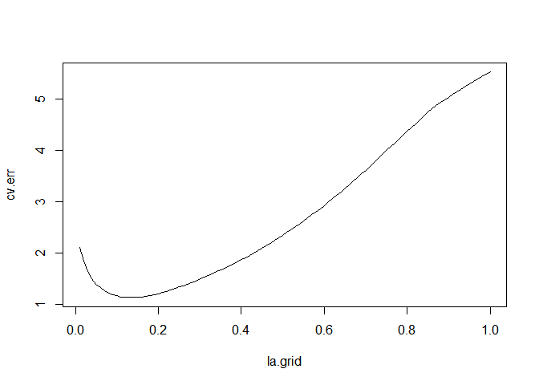

Build a function to perform KFold CV
================
Joshua Freimark
01/2019

  - R version 4.0.0 (2020-04-24)

  - Build a function that performs K-fold cross validation.

Simulate data

``` r
n=200;p=500
x=matrix(rnorm(n*p),n,p)
b=c(rep(1,5),rep(0,p-5))

y=1+x%*%b+rnorm(n)
length(y); dim(x)   
```

    ## [1] 200

    ## [1] 200 500

Implementing LASSO

``` r
library(glmnet)
model.lasso=glmnet(x,y)      #Set alpha=1  for LASSO. By default the function glmnet will fit a lasso estimate
hb=coef(model.lasso,s=0.2)   #s = Lambda value. We will try 0.2 to start out
#hb
```

Implementing ridge

``` r
model.ridge=glmnet(x,y,alpha=0)         #alpha=0 indicates the ridge penalty
hb=coef(model.ridge,s=0.2)              #The tuning parameter (lambda) is represented by `s` in this function
#hb
```

Choosing lambda via cross validation. Begin with lambda=0.01

``` r
dat=data.frame(x=x,y=y)
la.grid=seq(0.01,1,length.out=100)
la.grid
```

    ##   [1] 0.01 0.02 0.03 0.04 0.05 0.06 0.07 0.08 0.09 0.10 0.11 0.12 0.13 0.14 0.15
    ##  [16] 0.16 0.17 0.18 0.19 0.20 0.21 0.22 0.23 0.24 0.25 0.26 0.27 0.28 0.29 0.30
    ##  [31] 0.31 0.32 0.33 0.34 0.35 0.36 0.37 0.38 0.39 0.40 0.41 0.42 0.43 0.44 0.45
    ##  [46] 0.46 0.47 0.48 0.49 0.50 0.51 0.52 0.53 0.54 0.55 0.56 0.57 0.58 0.59 0.60
    ##  [61] 0.61 0.62 0.63 0.64 0.65 0.66 0.67 0.68 0.69 0.70 0.71 0.72 0.73 0.74 0.75
    ##  [76] 0.76 0.77 0.78 0.79 0.80 0.81 0.82 0.83 0.84 0.85 0.86 0.87 0.88 0.89 0.90
    ##  [91] 0.91 0.92 0.93 0.94 0.95 0.96 0.97 0.98 0.99 1.00

Compute the corresponding cross validation error (cv.err) for the
associated Lambda value

``` r
k=5     #no.of fols
n=length(dat$y)
ncv=ceiling(n/k)
cv.ind.f=rep(seq(1:k),ncv)
cv.ind=cv.ind.f[1:n]
cv.ind.random=sample(cv.ind,n,replace=F)

cv.err=c()
```

The cross validation function

``` r
for(l in 1:length(la.grid)){
  MSE=c()
  for(j in 1:k){
    train=dat[cv.ind.random!=j,]
    response=train$y
    design=as.matrix(train[,names(dat)!="y"])
    mod=glmnet(design,response,lambda=la.grid)
    hb=coef(mod,s=la.grid[l])
    test=dat[cv.ind.random==j,]
    resp.test=test$y
    fitted.values=cbind(1,as.matrix(test[,names(dat)!="y"]))%*%hb
    MSE[j]=mean((resp.test-fitted.values)^2)
  }
  cv.err[l]=mean(MSE)
}
```

Graph displaying the CV error associated with each lambda value

``` r
plot(la.grid, cv.err,type="l")   
```

<!-- -->

``` r
best.la=la.grid[which.min(cv.err)]
best.la        #Returns the optimal value for lambda
```

    ## [1] 0.13

Using the optimal value of lambda selected from the CV function to
estimate LASSO

``` r
model=glmnet(x,y)
final.hb=coef(model,s=best.la)
final.hb
```

    ## 501 x 1 sparse Matrix of class "dgCMatrix"
    ##                         1
    ## (Intercept)  1.017436e+00
    ## V1           8.481735e-01
    ## V2           9.336216e-01
    ## V3           7.665031e-01
    ## V4           7.566930e-01
    ## V5           8.124712e-01
    ## V6           .           
    ## V7           .           
    ## V8           .           
    ## V9           .           
    ## V10          .           
    ## V11          .           
    ## V12          .           
    ## V13          .           
    ## V14          .           
    ## V15          .           
    ## V16          .           
    ## V17          .           
    ## V18          .           
    ## V19          .           
    ## V20          .           
    ## V21          .           
    ## V22          .           
    ## V23          .           
    ## V24          .           
    ## V25          4.895906e-02
    ## V26          .           
    ## V27          .           
    ## V28          .           
    ## V29          .           
    ## V30          .           
    ## V31          .           
    ## V32          .           
    ## V33          .           
    ## V34          .           
    ## V35          .           
    ## V36          .           
    ## V37          .           
    ## V38          .           
    ## V39          .           
    ## V40          .           
    ## V41          .           
    ## V42          .           
    ## V43          .           
    ## V44          .           
    ## V45          .           
    ## V46          .           
    ## V47          .           
    ## V48          .           
    ## V49          .           
    ## V50          .           
    ## V51          .           
    ## V52          .           
    ## V53          .           
    ## V54         -6.828117e-03
    ## V55          .           
    ## V56          .           
    ## V57         -2.378434e-05
    ## V58          .           
    ## V59          .           
    ## V60          .           
    ## V61         -1.103226e-04
    ## V62          .           
    ## V63          .           
    ## V64          .           
    ## V65          .           
    ## V66          .           
    ## V67          .           
    ## V68          .           
    ## V69          .           
    ## V70          8.584561e-02
    ## V71          .           
    ## V72          .           
    ## V73          .           
    ## V74          .           
    ## V75          .           
    ## V76          .           
    ## V77          3.795273e-03
    ## V78          .           
    ## V79          .           
    ## V80          .           
    ## V81          .           
    ## V82          .           
    ## V83          .           
    ## V84          .           
    ## V85          .           
    ## V86          .           
    ## V87          .           
    ## V88          .           
    ## V89          .           
    ## V90          .           
    ## V91          .           
    ## V92          .           
    ## V93          .           
    ## V94          .           
    ## V95          .           
    ## V96          .           
    ## V97          .           
    ## V98          .           
    ## V99          .           
    ## V100         .           
    ## V101         9.078445e-05
    ## V102         .           
    ## V103         .           
    ## V104         .           
    ## V105         .           
    ## V106         .           
    ## V107         .           
    ## V108         .           
    ## V109         .           
    ## V110         .           
    ## V111         .           
    ## V112         .           
    ## V113         .           
    ## V114         .           
    ## V115         .           
    ## V116         .           
    ## V117         .           
    ## V118         .           
    ## V119         .           
    ## V120         .           
    ## V121         .           
    ## V122         .           
    ## V123         .           
    ## V124         .           
    ## V125         .           
    ## V126         .           
    ## V127         .           
    ## V128         .           
    ## V129         .           
    ## V130         .           
    ## V131         .           
    ## V132         .           
    ## V133         .           
    ## V134         .           
    ## V135         .           
    ## V136         .           
    ## V137         .           
    ## V138         .           
    ## V139         .           
    ## V140         .           
    ## V141         .           
    ## V142         .           
    ## V143         .           
    ## V144         .           
    ## V145         .           
    ## V146         .           
    ## V147         .           
    ## V148         .           
    ## V149         .           
    ## V150         .           
    ## V151         .           
    ## V152         .           
    ## V153         .           
    ## V154         .           
    ## V155        -3.249057e-02
    ## V156         .           
    ## V157         .           
    ## V158         .           
    ## V159         .           
    ## V160         .           
    ## V161         .           
    ## V162         .           
    ## V163         .           
    ## V164         .           
    ## V165         .           
    ## V166         .           
    ## V167         .           
    ## V168         .           
    ## V169         .           
    ## V170         .           
    ## V171         .           
    ## V172         .           
    ## V173         .           
    ## V174         .           
    ## V175         .           
    ## V176         .           
    ## V177        -1.758256e-04
    ## V178         .           
    ## V179         .           
    ## V180         .           
    ## V181         .           
    ## V182         .           
    ## V183         .           
    ## V184         .           
    ## V185         .           
    ## V186         .           
    ## V187         .           
    ## V188         .           
    ## V189         .           
    ## V190         .           
    ## V191         .           
    ## V192         7.733581e-05
    ## V193         .           
    ## V194         .           
    ## V195         .           
    ## V196         .           
    ## V197         .           
    ## V198         .           
    ## V199         .           
    ## V200         .           
    ## V201         .           
    ## V202         .           
    ## V203         .           
    ## V204         .           
    ## V205         .           
    ## V206         .           
    ## V207         .           
    ## V208         .           
    ## V209        -3.683013e-02
    ## V210         .           
    ## V211         .           
    ## V212         .           
    ## V213         3.066657e-02
    ## V214         .           
    ## V215         .           
    ## V216         .           
    ## V217         .           
    ## V218         .           
    ## V219         .           
    ## V220         .           
    ## V221         .           
    ## V222         .           
    ## V223         .           
    ## V224         .           
    ## V225         .           
    ## V226         .           
    ## V227         .           
    ## V228         .           
    ## V229         .           
    ## V230         .           
    ## V231         .           
    ## V232         .           
    ## V233         .           
    ## V234         .           
    ## V235         .           
    ## V236         .           
    ## V237         .           
    ## V238         .           
    ## V239         .           
    ## V240         .           
    ## V241         .           
    ## V242         .           
    ## V243         .           
    ## V244         .           
    ## V245         .           
    ## V246         .           
    ## V247         .           
    ## V248         .           
    ## V249         .           
    ## V250         .           
    ## V251         .           
    ## V252         .           
    ## V253         .           
    ## V254         .           
    ## V255         .           
    ## V256         .           
    ## V257         .           
    ## V258         8.121614e-02
    ## V259         .           
    ## V260         .           
    ## V261         .           
    ## V262         .           
    ## V263         .           
    ## V264         .           
    ## V265         .           
    ## V266         .           
    ## V267         .           
    ## V268         .           
    ## V269         .           
    ## V270         .           
    ## V271        -9.281964e-05
    ## V272         2.588110e-02
    ## V273         .           
    ## V274         .           
    ## V275         .           
    ## V276         .           
    ## V277         .           
    ## V278         .           
    ## V279         .           
    ## V280         .           
    ## V281         .           
    ## V282         .           
    ## V283         .           
    ## V284         .           
    ## V285         .           
    ## V286         .           
    ## V287         .           
    ## V288         .           
    ## V289         .           
    ## V290         .           
    ## V291         .           
    ## V292         .           
    ## V293         .           
    ## V294         .           
    ## V295         .           
    ## V296         .           
    ## V297         .           
    ## V298         .           
    ## V299         .           
    ## V300         .           
    ## V301         .           
    ## V302         .           
    ## V303         .           
    ## V304         .           
    ## V305         .           
    ## V306         .           
    ## V307         .           
    ## V308         .           
    ## V309         .           
    ## V310         .           
    ## V311         .           
    ## V312         .           
    ## V313         .           
    ## V314         .           
    ## V315         .           
    ## V316         .           
    ## V317         .           
    ## V318         .           
    ## V319         .           
    ## V320         .           
    ## V321         .           
    ## V322         .           
    ## V323         4.005358e-03
    ## V324         .           
    ## V325         .           
    ## V326         .           
    ## V327         .           
    ## V328         .           
    ## V329         2.221799e-04
    ## V330         .           
    ## V331         .           
    ## V332         .           
    ## V333         .           
    ## V334         .           
    ## V335         .           
    ## V336         .           
    ## V337         .           
    ## V338         .           
    ## V339         .           
    ## V340         .           
    ## V341         .           
    ## V342         .           
    ## V343         .           
    ## V344         .           
    ## V345         .           
    ## V346         .           
    ## V347         .           
    ## V348        -2.449038e-02
    ## V349         .           
    ## V350         .           
    ## V351         .           
    ## V352         .           
    ## V353         .           
    ## V354         .           
    ## V355         .           
    ## V356         .           
    ## V357         .           
    ## V358         .           
    ## V359         .           
    ## V360         .           
    ## V361         .           
    ## V362         .           
    ## V363         .           
    ## V364         .           
    ## V365         .           
    ## V366         .           
    ## V367         .           
    ## V368         .           
    ## V369         .           
    ## V370         .           
    ## V371         .           
    ## V372         .           
    ## V373         .           
    ## V374         .           
    ## V375         .           
    ## V376         .           
    ## V377         .           
    ## V378         .           
    ## V379         .           
    ## V380         .           
    ## V381         .           
    ## V382         .           
    ## V383         .           
    ## V384         .           
    ## V385         .           
    ## V386         1.317000e-02
    ## V387         .           
    ## V388         .           
    ## V389         .           
    ## V390         .           
    ## V391         .           
    ## V392         .           
    ## V393         .           
    ## V394         .           
    ## V395         .           
    ## V396         .           
    ## V397         2.131845e-02
    ## V398         .           
    ## V399         .           
    ## V400         .           
    ## V401         .           
    ## V402         .           
    ## V403         .           
    ## V404         .           
    ## V405         .           
    ## V406         .           
    ## V407         .           
    ## V408         .           
    ## V409         .           
    ## V410         .           
    ## V411         .           
    ## V412         .           
    ## V413         .           
    ## V414         .           
    ## V415         .           
    ## V416         .           
    ## V417         .           
    ## V418         .           
    ## V419         .           
    ## V420         .           
    ## V421         .           
    ## V422         .           
    ## V423         .           
    ## V424         .           
    ## V425         .           
    ## V426         .           
    ## V427         .           
    ## V428         .           
    ## V429         .           
    ## V430         .           
    ## V431         .           
    ## V432         .           
    ## V433         .           
    ## V434         .           
    ## V435         .           
    ## V436         .           
    ## V437         .           
    ## V438         .           
    ## V439         .           
    ## V440         .           
    ## V441         .           
    ## V442         .           
    ## V443         .           
    ## V444         .           
    ## V445        -1.640337e-02
    ## V446         .           
    ## V447         .           
    ## V448         .           
    ## V449         .           
    ## V450         .           
    ## V451         .           
    ## V452         .           
    ## V453         .           
    ## V454         .           
    ## V455         .           
    ## V456         .           
    ## V457         .           
    ## V458         .           
    ## V459         .           
    ## V460         1.845485e-01
    ## V461         .           
    ## V462         .           
    ## V463         .           
    ## V464         .           
    ## V465         .           
    ## V466         .           
    ## V467         .           
    ## V468         .           
    ## V469         .           
    ## V470         .           
    ## V471         .           
    ## V472         .           
    ## V473         6.842337e-03
    ## V474         .           
    ## V475         .           
    ## V476         .           
    ## V477         .           
    ## V478         .           
    ## V479         .           
    ## V480         .           
    ## V481         .           
    ## V482         .           
    ## V483         .           
    ## V484         .           
    ## V485         .           
    ## V486         .           
    ## V487         .           
    ## V488         .           
    ## V489         .           
    ## V490         2.636885e-04
    ## V491         .           
    ## V492         .           
    ## V493         .           
    ## V494         .           
    ## V495         .           
    ## V496         .           
    ## V497         .           
    ## V498         .           
    ## V499         .           
    ## V500         .

Using the built in function glmnet to compare if the function we created
returns similar results as glmnet

``` r
cv.mod=cv.glmnet(x,y,nfolds = 5,lambda = seq(0.01,1,length.out = 100))
cv.mod$lambda.min  #Should return a value close to the value of best.la
```

    ## [1] 0.15

-----

Logistic regression to estimate if the S\&P500 will move up or down.

``` r
library(ISLR)
data(Smarket)

logit.model=glm(Direction~Lag1+Lag2+Lag3+Lag4+Volume,
                data=Smarket,family=binomial)

summary(logit.model)
```

    ## 
    ## Call:
    ## glm(formula = Direction ~ Lag1 + Lag2 + Lag3 + Lag4 + Volume, 
    ##     family = binomial, data = Smarket)
    ## 
    ## Deviance Residuals: 
    ##    Min      1Q  Median      3Q     Max  
    ## -1.448  -1.202   1.068   1.145   1.317  
    ## 
    ## Coefficients:
    ##              Estimate Std. Error z value Pr(>|z|)
    ## (Intercept) -0.124785   0.240659  -0.519    0.604
    ## Lag1        -0.073126   0.050164  -1.458    0.145
    ## Lag2        -0.042360   0.050084  -0.846    0.398
    ## Lag3         0.010869   0.049929   0.218    0.828
    ## Lag4         0.009058   0.049947   0.181    0.856
    ## Volume       0.134660   0.158312   0.851    0.395
    ## 
    ## (Dispersion parameter for binomial family taken to be 1)
    ## 
    ##     Null deviance: 1731.2  on 1249  degrees of freedom
    ## Residual deviance: 1727.6  on 1244  degrees of freedom
    ## AIC: 1739.6
    ## 
    ## Number of Fisher Scoring iterations: 3

``` r
glm.probs=predict(logit.model,type="response")
glm.probs[1:10]
```

    ##         1         2         3         4         5         6         7         8 
    ## 0.4944585 0.4844253 0.4878925 0.5156843 0.5097410 0.5044691 0.4900052 0.5107911 
    ##         9        10 
    ## 0.5160232 0.4882519

``` r
glm.pred=rep("Down",1250)
glm.pred[glm.probs>0.5]="Up"
glm.pred
```

    ##    [1] "Down" "Down" "Down" "Up"   "Up"   "Up"   "Down" "Up"   "Up"   "Down"
    ##   [11] "Down" "Up"   "Up"   "Down" "Down" "Up"   "Up"   "Up"   "Up"   "Down"
    ##   [21] "Up"   "Up"   "Up"   "Down" "Up"   "Up"   "Down" "Up"   "Up"   "Up"  
    ##   [31] "Up"   "Up"   "Down" "Down" "Up"   "Up"   "Up"   "Down" "Down" "Down"
    ##   [41] "Down" "Up"   "Up"   "Up"   "Up"   "Up"   "Up"   "Down" "Up"   "Up"  
    ##   [51] "Up"   "Down" "Down" "Down" "Up"   "Up"   "Down" "Up"   "Up"   "Up"  
    ##   [61] "Down" "Down" "Up"   "Down" "Down" "Down" "Down" "Down" "Down" "Down"
    ##   [71] "Up"   "Up"   "Up"   "Down" "Down" "Down" "Up"   "Down" "Up"   "Up"  
    ##   [81] "Down" "Down" "Up"   "Up"   "Up"   "Up"   "Down" "Down" "Down" "Down"
    ##   [91] "Up"   "Down" "Up"   "Up"   "Up"   "Up"   "Up"   "Up"   "Up"   "Down"
    ##  [101] "Down" "Down" "Up"   "Up"   "Up"   "Up"   "Up"   "Up"   "Up"   "Up"  
    ##  [111] "Up"   "Up"   "Down" "Down" "Up"   "Up"   "Up"   "Up"   "Down" "Up"  
    ##  [121] "Down" "Down" "Up"   "Up"   "Up"   "Up"   "Up"   "Down" "Down" "Up"  
    ##  [131] "Up"   "Up"   "Up"   "Up"   "Up"   "Up"   "Down" "Down" "Down" "Up"  
    ##  [141] "Up"   "Up"   "Down" "Up"   "Up"   "Up"   "Up"   "Up"   "Down" "Down"
    ##  [151] "Up"   "Up"   "Up"   "Up"   "Up"   "Up"   "Up"   "Down" "Down" "Down"
    ##  [161] "Up"   "Up"   "Up"   "Up"   "Down" "Up"   "Up"   "Up"   "Up"   "Up"  
    ##  [171] "Up"   "Up"   "Up"   "Up"   "Down" "Down" "Up"   "Up"   "Down" "Down"
    ##  [181] "Up"   "Down" "Up"   "Up"   "Up"   "Up"   "Down" "Down" "Up"   "Up"  
    ##  [191] "Up"   "Up"   "Up"   "Up"   "Down" "Up"   "Up"   "Down" "Down" "Up"  
    ##  [201] "Up"   "Up"   "Down" "Down" "Down" "Down" "Up"   "Up"   "Up"   "Up"  
    ##  [211] "Down" "Down" "Up"   "Up"   "Down" "Up"   "Up"   "Down" "Down" "Up"  
    ##  [221] "Up"   "Up"   "Down" "Up"   "Up"   "Down" "Up"   "Up"   "Up"   "Up"  
    ##  [231] "Up"   "Up"   "Up"   "Down" "Down" "Up"   "Up"   "Up"   "Down" "Down"
    ##  [241] "Down" "Down" "Up"   "Up"   "Down" "Down" "Up"   "Up"   "Up"   "Up"  
    ##  [251] "Up"   "Up"   "Up"   "Up"   "Up"   "Up"   "Up"   "Up"   "Up"   "Up"  
    ##  [261] "Up"   "Up"   "Up"   "Down" "Up"   "Up"   "Up"   "Up"   "Up"   "Down"
    ##  [271] "Down" "Up"   "Up"   "Up"   "Up"   "Up"   "Up"   "Up"   "Up"   "Down"
    ##  [281] "Down" "Up"   "Up"   "Down" "Down" "Up"   "Up"   "Up"   "Up"   "Down"
    ##  [291] "Up"   "Up"   "Up"   "Down" "Down" "Up"   "Up"   "Up"   "Up"   "Up"  
    ##  [301] "Up"   "Down" "Down" "Up"   "Up"   "Up"   "Up"   "Up"   "Up"   "Up"  
    ##  [311] "Up"   "Up"   "Up"   "Up"   "Down" "Down" "Up"   "Up"   "Up"   "Up"  
    ##  [321] "Up"   "Up"   "Up"   "Up"   "Up"   "Down" "Up"   "Up"   "Up"   "Up"  
    ##  [331] "Down" "Down" "Up"   "Down" "Down" "Up"   "Up"   "Down" "Up"   "Up"  
    ##  [341] "Up"   "Down" "Up"   "Up"   "Up"   "Up"   "Up"   "Up"   "Up"   "Down"
    ##  [351] "Up"   "Up"   "Up"   "Up"   "Up"   "Up"   "Up"   "Down" "Down" "Up"  
    ##  [361] "Up"   "Up"   "Up"   "Up"   "Up"   "Up"   "Up"   "Up"   "Up"   "Up"  
    ##  [371] "Down" "Down" "Up"   "Up"   "Up"   "Up"   "Up"   "Up"   "Up"   "Up"  
    ##  [381] "Up"   "Up"   "Up"   "Down" "Down" "Up"   "Down" "Down" "Up"   "Up"  
    ##  [391] "Up"   "Up"   "Down" "Down" "Down" "Down" "Up"   "Up"   "Down" "Down"
    ##  [401] "Up"   "Down" "Up"   "Up"   "Down" "Up"   "Up"   "Up"   "Up"   "Up"  
    ##  [411] "Down" "Up"   "Up"   "Up"   "Down" "Down" "Down" "Down" "Up"   "Up"  
    ##  [421] "Down" "Up"   "Up"   "Up"   "Up"   "Up"   "Up"   "Down" "Down" "Up"  
    ##  [431] "Up"   "Down" "Up"   "Up"   "Up"   "Up"   "Up"   "Up"   "Up"   "Down"
    ##  [441] "Down" "Down" "Up"   "Up"   "Down" "Down" "Up"   "Up"   "Up"   "Down"
    ##  [451] "Up"   "Up"   "Up"   "Up"   "Down" "Down" "Down" "Up"   "Up"   "Up"  
    ##  [461] "Up"   "Up"   "Up"   "Down" "Down" "Up"   "Up"   "Down" "Down" "Up"  
    ##  [471] "Up"   "Up"   "Down" "Down" "Up"   "Up"   "Up"   "Up"   "Up"   "Up"  
    ##  [481] "Up"   "Down" "Up"   "Up"   "Down" "Down" "Up"   "Up"   "Up"   "Down"
    ##  [491] "Down" "Up"   "Up"   "Up"   "Down" "Down" "Down" "Down" "Up"   "Up"  
    ##  [501] "Up"   "Down" "Up"   "Up"   "Up"   "Up"   "Up"   "Up"   "Up"   "Up"  
    ##  [511] "Up"   "Up"   "Up"   "Down" "Up"   "Up"   "Down" "Up"   "Up"   "Up"  
    ##  [521] "Up"   "Up"   "Up"   "Up"   "Up"   "Down" "Down" "Up"   "Up"   "Up"  
    ##  [531] "Up"   "Up"   "Up"   "Up"   "Down" "Up"   "Up"   "Up"   "Up"   "Up"  
    ##  [541] "Up"   "Up"   "Up"   "Down" "Down" "Down" "Down" "Up"   "Up"   "Down"
    ##  [551] "Up"   "Up"   "Up"   "Up"   "Up"   "Up"   "Up"   "Down" "Down" "Up"  
    ##  [561] "Up"   "Up"   "Up"   "Up"   "Up"   "Down" "Down" "Up"   "Up"   "Down"
    ##  [571] "Down" "Down" "Up"   "Up"   "Down" "Down" "Up"   "Up"   "Down" "Up"  
    ##  [581] "Up"   "Up"   "Up"   "Down" "Down" "Up"   "Up"   "Up"   "Up"   "Up"  
    ##  [591] "Up"   "Up"   "Down" "Down" "Down" "Down" "Up"   "Up"   "Up"   "Up"  
    ##  [601] "Down" "Up"   "Up"   "Up"   "Up"   "Down" "Up"   "Up"   "Down" "Down"
    ##  [611] "Up"   "Up"   "Up"   "Up"   "Up"   "Up"   "Up"   "Up"   "Up"   "Up"  
    ##  [621] "Down" "Down" "Down" "Down" "Up"   "Up"   "Up"   "Down" "Up"   "Up"  
    ##  [631] "Up"   "Up"   "Up"   "Up"   "Up"   "Up"   "Down" "Down" "Up"   "Up"  
    ##  [641] "Up"   "Up"   "Up"   "Up"   "Up"   "Down" "Down" "Down" "Down" "Up"  
    ##  [651] "Up"   "Down" "Down" "Down" "Up"   "Up"   "Up"   "Up"   "Up"   "Down"
    ##  [661] "Down" "Down" "Down" "Up"   "Up"   "Up"   "Up"   "Up"   "Up"   "Up"  
    ##  [671] "Down" "Up"   "Down" "Up"   "Up"   "Up"   "Up"   "Up"   "Up"   "Up"  
    ##  [681] "Up"   "Down" "Up"   "Down" "Down" "Up"   "Down" "Up"   "Up"   "Up"  
    ##  [691] "Up"   "Down" "Down" "Up"   "Up"   "Up"   "Up"   "Up"   "Up"   "Up"  
    ##  [701] "Up"   "Up"   "Down" "Up"   "Up"   "Up"   "Down" "Up"   "Up"   "Up"  
    ##  [711] "Up"   "Up"   "Up"   "Down" "Up"   "Up"   "Up"   "Up"   "Up"   "Up"  
    ##  [721] "Up"   "Down" "Down" "Up"   "Down" "Down" "Up"   "Up"   "Up"   "Up"  
    ##  [731] "Up"   "Up"   "Up"   "Down" "Down" "Up"   "Up"   "Up"   "Down" "Up"  
    ##  [741] "Up"   "Up"   "Down" "Down" "Down" "Down" "Up"   "Up"   "Up"   "Up"  
    ##  [751] "Up"   "Up"   "Up"   "Up"   "Up"   "Up"   "Up"   "Up"   "Up"   "Up"  
    ##  [761] "Up"   "Up"   "Down" "Up"   "Up"   "Up"   "Up"   "Up"   "Up"   "Up"  
    ##  [771] "Up"   "Down" "Up"   "Up"   "Up"   "Up"   "Up"   "Up"   "Up"   "Up"  
    ##  [781] "Up"   "Up"   "Up"   "Up"   "Up"   "Up"   "Up"   "Up"   "Up"   "Up"  
    ##  [791] "Up"   "Up"   "Up"   "Up"   "Up"   "Up"   "Up"   "Up"   "Down" "Up"  
    ##  [801] "Up"   "Up"   "Up"   "Up"   "Down" "Down" "Down" "Down" "Up"   "Up"  
    ##  [811] "Up"   "Down" "Up"   "Up"   "Up"   "Down" "Up"   "Up"   "Up"   "Up"  
    ##  [821] "Up"   "Up"   "Up"   "Down" "Down" "Up"   "Up"   "Up"   "Up"   "Up"  
    ##  [831] "Up"   "Up"   "Up"   "Up"   "Up"   "Up"   "Up"   "Up"   "Up"   "Up"  
    ##  [841] "Up"   "Up"   "Up"   "Up"   "Up"   "Up"   "Down" "Down" "Up"   "Up"  
    ##  [851] "Up"   "Up"   "Up"   "Up"   "Down" "Down" "Up"   "Up"   "Up"   "Up"  
    ##  [861] "Down" "Up"   "Up"   "Up"   "Up"   "Down" "Up"   "Up"   "Up"   "Up"  
    ##  [871] "Up"   "Up"   "Up"   "Up"   "Up"   "Up"   "Up"   "Down" "Up"   "Up"  
    ##  [881] "Up"   "Up"   "Up"   "Up"   "Up"   "Up"   "Up"   "Up"   "Up"   "Up"  
    ##  [891] "Up"   "Up"   "Up"   "Up"   "Up"   "Up"   "Up"   "Up"   "Down" "Up"  
    ##  [901] "Up"   "Up"   "Down" "Down" "Down" "Up"   "Up"   "Up"   "Up"   "Down"
    ##  [911] "Down" "Down" "Up"   "Up"   "Down" "Down" "Down" "Up"   "Up"   "Up"  
    ##  [921] "Up"   "Up"   "Up"   "Up"   "Up"   "Up"   "Up"   "Up"   "Up"   "Up"  
    ##  [931] "Up"   "Up"   "Up"   "Up"   "Up"   "Down" "Down" "Up"   "Up"   "Up"  
    ##  [941] "Up"   "Up"   "Up"   "Up"   "Up"   "Up"   "Down" "Up"   "Up"   "Up"  
    ##  [951] "Up"   "Up"   "Down" "Down" "Up"   "Up"   "Up"   "Up"   "Up"   "Down"
    ##  [961] "Up"   "Up"   "Up"   "Up"   "Down" "Down" "Up"   "Up"   "Up"   "Up"  
    ##  [971] "Up"   "Up"   "Up"   "Down" "Down" "Up"   "Up"   "Up"   "Up"   "Up"  
    ##  [981] "Up"   "Up"   "Up"   "Up"   "Up"   "Up"   "Up"   "Up"   "Up"   "Up"  
    ##  [991] "Up"   "Down" "Down" "Down" "Up"   "Down" "Down" "Down" "Down" "Up"  
    ## [1001] "Up"   "Up"   "Up"   "Up"   "Up"   "Up"   "Up"   "Up"   "Up"   "Down"
    ## [1011] "Up"   "Up"   "Up"   "Up"   "Up"   "Up"   "Up"   "Up"   "Up"   "Up"  
    ## [1021] "Up"   "Up"   "Up"   "Up"   "Up"   "Up"   "Up"   "Up"   "Up"   "Up"  
    ## [1031] "Up"   "Up"   "Up"   "Up"   "Up"   "Down" "Down" "Up"   "Up"   "Up"  
    ## [1041] "Up"   "Up"   "Up"   "Up"   "Up"   "Up"   "Up"   "Up"   "Up"   "Up"  
    ## [1051] "Up"   "Up"   "Up"   "Up"   "Up"   "Up"   "Up"   "Up"   "Up"   "Up"  
    ## [1061] "Up"   "Up"   "Up"   "Up"   "Up"   "Up"   "Up"   "Up"   "Up"   "Up"  
    ## [1071] "Up"   "Up"   "Up"   "Up"   "Up"   "Up"   "Up"   "Up"   "Up"   "Up"  
    ## [1081] "Up"   "Up"   "Up"   "Up"   "Up"   "Up"   "Up"   "Up"   "Up"   "Up"  
    ## [1091] "Up"   "Up"   "Up"   "Up"   "Up"   "Up"   "Up"   "Up"   "Up"   "Up"  
    ## [1101] "Up"   "Up"   "Up"   "Up"   "Up"   "Up"   "Up"   "Up"   "Up"   "Up"  
    ## [1111] "Up"   "Up"   "Up"   "Up"   "Up"   "Up"   "Up"   "Up"   "Up"   "Up"  
    ## [1121] "Up"   "Up"   "Up"   "Up"   "Up"   "Up"   "Up"   "Up"   "Up"   "Up"  
    ## [1131] "Up"   "Up"   "Up"   "Up"   "Up"   "Up"   "Up"   "Up"   "Up"   "Up"  
    ## [1141] "Up"   "Up"   "Up"   "Up"   "Up"   "Up"   "Up"   "Up"   "Up"   "Up"  
    ## [1151] "Up"   "Up"   "Up"   "Up"   "Up"   "Up"   "Up"   "Up"   "Up"   "Up"  
    ## [1161] "Up"   "Up"   "Up"   "Up"   "Up"   "Up"   "Up"   "Up"   "Up"   "Up"  
    ## [1171] "Up"   "Up"   "Up"   "Up"   "Up"   "Up"   "Up"   "Up"   "Up"   "Up"  
    ## [1181] "Up"   "Up"   "Up"   "Up"   "Up"   "Up"   "Up"   "Up"   "Up"   "Up"  
    ## [1191] "Up"   "Up"   "Up"   "Up"   "Up"   "Up"   "Up"   "Up"   "Up"   "Up"  
    ## [1201] "Up"   "Up"   "Up"   "Up"   "Up"   "Up"   "Up"   "Up"   "Up"   "Up"  
    ## [1211] "Up"   "Up"   "Up"   "Up"   "Up"   "Up"   "Up"   "Up"   "Up"   "Up"  
    ## [1221] "Up"   "Up"   "Up"   "Up"   "Up"   "Up"   "Down" "Up"   "Up"   "Up"  
    ## [1231] "Up"   "Up"   "Up"   "Up"   "Up"   "Up"   "Up"   "Up"   "Up"   "Up"  
    ## [1241] "Up"   "Up"   "Up"   "Up"   "Up"   "Up"   "Up"   "Up"   "Up"   "Up"

Confusion matrix

``` r
table(glm.pred,Smarket$Direction)
```

    ##         
    ## glm.pred Down  Up
    ##     Down  146 136
    ##     Up    456 512

Another example building a cross validation function

``` r
set.seed(1234)
n=202
x=rnorm(n)
y=-1-0.5*x+1*x^2+rnorm(n)
```

``` r
dat=data.frame(y=y,x=x)

k=5   #no. of folds
n=length(dat$y)
ncv=ceiling(n/k); ncv
```

    ## [1] 41

``` r
cv.ind.f=rep(seq(1:k),ncv)
#cv.ind.f

cv.ind=cv.ind.f[1:n]
length(cv.ind)
```

    ## [1] 202

``` r
cv.ind.random=sample(cv.ind,n,replace=F)
#cv.ind.random
```

Build the cross validation function

``` r
cv.function=function(dat,k){
  n=length(dat$y)
  if(k>n){stop("check no. of folds")}
  ncv=ceiling(n/k); 
  ##ceiling function is the smallest integer>x
  ##Example: 4.2-->5, 4.7-->5
  cv.ind.f=rep(seq(1:k),ncv)
  #cv.ind.f
  cv.ind=cv.ind.f[1:n]
  #length(cv.ind)
  cv.ind.random=sample(cv.ind,n,replace=F)
  #cv.ind.random
  MSE=c()
  for(j in 1:k){
    train=dat[cv.ind.random!=j,]
    response=train$y
    design=as.matrix(train[,names(dat)!="y"])
    mod=lm(response~design)
    hb=coef(mod)
    test=dat[cv.ind.random==j,]
    resp.test=test$y
    fitted.values=cbind(1,as.matrix(test[,names(dat)!="y"]))%*%hb
    MSE[j]=mean((resp.test-fitted.values)^2)}
  cv.err=mean(MSE)
  #cv.err
  return(cv.err)}
```

Models to choose from. Select the model with the lowest cvm (which is
the MSE)

``` r
cvm=c()
dat1=data.frame(y=y,x1=x)
cvm[1]=cv.function(dat1,k=5)

dat2=data.frame(y=y,x1=x,x2=x^2)
cvm[2]=cv.function(dat2,k=5)

dat3=data.frame(y=y,x1=x,x2=x^2,x3=x^3)
cvm[3]=cv.function(dat3,k=5)

dat4=data.frame(y=y,x1=x,x2=x^2,x3=x^3,x4=x^4)
cvm[4]=cv.function(dat4,k=5)

dat5=data.frame(y=y,x1=x,x2=x^2,x3=x^3,x4=x^4,x5=x^5)
cvm[5]=cv.function(dat5,k=5)

dat6=data.frame(y=y,x1=x,x2=x^2,x3=x^3,x4=x^4,x5=x^5,x6=x^6)
cvm[6]=cv.function(dat6,k=5)

cvm
```

    ## [1] 3.338297 1.036925 1.043529 1.077325 1.167861 1.412818

Forward selection

``` r
library(leaps)
regfit=regsubsets(y~., data=dat6, method="forward",nvmax=10)
s=summary(regfit)
s$adjr2
```

    ## [1] 0.5995153 0.6890295 0.6883059 0.6873254 0.6888908 0.6873049
